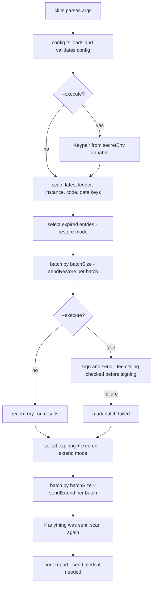

# Architecture

This page maps Perennial's modules and walks through what happens when you run `perennial run`.

Perennial is a small TypeScript CLI. There are no smart contracts in Perennial itself; the contract in `fixtures/contract` exists only for testing (see [Testing](/developers/testing)).

## Module map

```
cli.ts  ->  config.ts   load and validate the JSON config
        ->  scan.ts     read TTLs from Soroban RPC, classify each entry
        ->  run.ts      choose entries to restore/extend, batch them, call tx.ts
        ->  tx.ts       build, simulate, fee-check, sign, send, poll
        ->  alerts.ts   Slack, Telegram, webhook
keys.ts   builds ledger keys (instance, code, data)
scval.ts  turns JSON key descriptions into Soroban values
```

| Module | Responsibility | Key exports |
| --- | --- | --- |
| `src/cli.ts` | Argument parsing (`node:util` `parseArgs`), command dispatch, output formatting, exit codes | `main` |
| `src/config.ts` | Load and validate the JSON config, apply defaults, resolve RPC URL and passphrase | `loadConfig`, `parseConfig`, `resolveNetwork`, `DEFAULTS` |
| `src/scan.ts` | Fetch entries from Soroban RPC in batches of 50, compute `remaining`, classify into the four states | `scan`, `classify`, `ledgersToDays`, `makeServer` |
| `src/keys.ts` | Build XDR ledger keys for instance, code, and data entries | `instanceKey`, `codeKey`, `dataKey` |
| `src/scval.ts` | Convert a JSON key spec into an `xdr.ScVal` (9 types) | `toScVal` |
| `src/run.ts` | Decide what to do (restore set, extend set), chunk into batches, drive `tx.ts`, rescan after executing | `runKeeper` |
| `src/tx.ts` | Build transactions, simulate via `prepareTransaction`, enforce the fee ceiling, sign, send, poll for the result | `sendExtend`, `sendRestore` |
| `src/alerts.ts` | Format the report, POST to Slack / Telegram / generic webhook, never throw on alert failure | `sendAlerts`, `buildMessage`, `describe` |

## Flow of `run`



In words:

1. `scan` reads the latest ledger, then the instance, the wasm code (hash found from the instance), and each configured key.
2. Expired entries are restored in batches (each restore in its own transaction).
3. Expiring and restored entries are extended in batches.
4. If anything was sent, scan again and report the final state.
5. Alerts go out if anything needed attention or an action ran.

This matches `runKeeper` in `src/run.ts`: it filters `expired` (plus `missing` when `--include-missing`) for restore, then filters `expiring` and `expired` minus restore failures for extend.

## Design choices

- Dry run by default. `--execute` is required to spend fees.
- Secrets only from environment variables, including alert URLs and tokens.
- A fee ceiling is checked after simulation and before signing.
- Small modules so one issue touches one file.

See also the repo's own `docs/ARCHITECTURE.md`, which this page mirrors.
